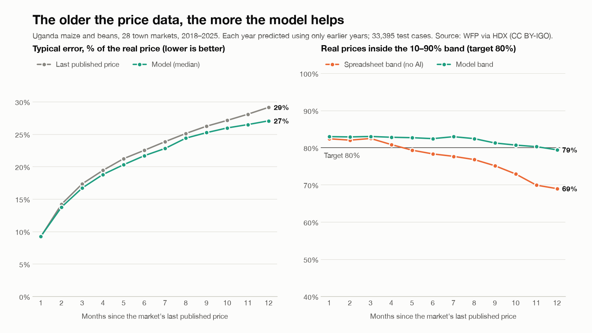

# Price SMS: is this offer fair?

An SMS price check for smallholder maize and bean sellers in Uganda, built for the World Bank "Small AI for Development" challenge (Hack-Nation 7, Annex B Agriculture).

**Live demo:** https://smallai-agri.vercel.app (phone simulator + co-op dashboard) · **Evidence:** [docs/EVIDENCE.md](docs/EVIDENCE.md) · **Video:** _added with the submission_

## The problem
Because of this tool, a smallholder farmer like Noor will know the fair price band for her maize or beans *before* she accepts a buyer's offer, which she would otherwise do blind; we know because the Côte d'Ivoire E-Agriculture project ($70M, P160418) broadcast prices to 400K farmers and never measured whether anyone received a better price.

Noor (the brief's persona) farms 2 ha with coffee, maize and beans, belongs to a coffee cooperative, and uses a basic phone (sometimes a smartphone) with 3G bundles and no Wi-Fi. At harvest a buyer names a price and she has no independent reference.

## What it does
Noor texts the offer the way she would say it. The service answers in her language with:
- the price per kg, converted from her unit (basin, tin, bag);
- this month's market band for that crop and town;
- a verdict (LOW / FAIR / GOOD) and what to ask for;
- where prices are heading over the next two months;
- a reminder that the reference is a town retail price and that she decides.

When the data cannot support an answer, it says so and sends her to a person.

```
Noor:  mahindi 20000 beseni arua
Tool:  Beseni ni kilo ngapi? Jibu 1=15kg 2=20kg
Noor:  1
Tool:  Mahindi Arua: 20,000/beseni (15kg) = 1,330/kg.
       Bei ya soko mwezi huu: 1,590-2,590/kg.
       Ofa ni CHINI (~34% chini ya wastani). Omba 30,500 kwa beseni.
       Miezi 2 ijayo: bei inashuka.
       Bei ya rejareja mjini, si ya shambani. Uamuzi ni wako.

Noor:  maize 1200 kg wakiso
Tool:  Not sure: last Wakiso market data is 18 months old. Ask your co-op or extension officer.
```
(Swahili reply: the offer is LOW, about 34% below average; ask for 30,500 per basin; prices are falling over the next two months; this is a town retail price, not farm-gate; the decision is yours.)

The co-op sees every reported offer on a dashboard. It shows each market's band before and after farmers' reports, and flags offers below the band.

## How it works
```
SMS ──► parser ──► unit check ──► band for crop × market ──► fail-safes ──► fixed sw/en template ──► SMS
        (rules +    (asks once      (precomputed model band,     (stale data,
        fuzzy       if a basin      refreshed by farmers'        wide band, unknown
        lexicon)    or bag is       reports: nowcaster)          market, low parser
                    ambiguous)                                   confidence, odd unit)
```
| Piece | What it is | Where |
|---|---|---|
| Parser | Rules + fuzzy lexicon (edit distance) for Swahili, English and Luganda crop, unit and market words. No language model. | `service/parser.py` |
| Band model | LightGBM quantile regression (10th/50th/90th percentile) on WFP monthly retail prices, 28 towns, 2008–2026. Forecasts the change since a market's last price as a function of how old that price is, then calibrated so 80% of real prices fall inside the band. Precomputed to `models/bands.json`. | `model/train.py` |
| Nowcaster | Bayesian update of a market's band from farmers' reported offers. Lowball-resistant: one vote per phone, at least two phones before anything moves, outliers down-weighted, old reports fade. | `model/nowcast.py` |
| Replies | Fixed Swahili/English templates. Nothing is generated freely. | `service/reply.py` |
| Co-op dashboard | Offers, bands before/after reports, below-band flags. Server-rendered, no internet needed. | `service/coop.py` |
| SMS gateway | Africa's Talking (sandbox). Optional; the local inbox works without it. | `service/sms_out.py` |

## Why AI, and not an SMS price broadcast, a spreadsheet or a Google search
- **The newest public price is months old.** WFP town prices end in April 2026, and in December 2025 for many towns. A broadcast or a spreadsheet repeats a stale number. Our model forecasts this month's band from the last price, the season and the market's history, and widens the band honestly as the data ages.
- **A spreadsheet band breaks exactly when it's needed.** Last price × historical changes catches the real price 82% of the time at a 1-month gap but only 69% at 12 months. Our calibrated band stays at 79–83% at every gap ([chart](docs/slides/backtest.png), 2018–2025, each year predicted only from earlier years).
- **Offers arrive in mixed languages and local units** ("kasooli 95,000/= ensawo owino"). The parser handles these and asks once when a unit is ambiguous.
- **The reference improves with use.** Farmers' reported offers update the band for their market (nowcasting), a price-received signal that price broadcasts do not collect.
- **A web search** gives no current per-basin price for maize in Arua, and does not work on a basic phone.



## Small AI: where it runs
- **Farmer side:** any basic phone, plain SMS. No app, no data bundle.
- **Co-op side:** one laptop or Raspberry Pi runs the whole service with no internet. It needs only an SMS gateway (cellular). Our code, templates and bands come to about 80 KB, with `bands.json` at 22 KB. Dependencies: FastAPI, Jinja2, rapidfuzz.
- **Monthly:** rebuild the bands on a laptop (`model/train.py`, ~30 s, three 250 KB model files) and copy `bands.json` to the co-op box. It's small enough to send over a weak link.
- **No cloud model, no GPU** anywhere in the farmer path.

Where it sits in Noor's day: the buyer arrives at the farm gate or she reaches the town market, names a price, and she texts it before agreeing. The reply arrives in seconds.

## Local language
- Replies in **Swahili** and **English** from fixed templates.
- The parser also understands **Luganda** crop and unit words (kasooli, ebijanjaalo, ensawo) and answers those messages in Swahili.
- How it fares in a less-supported language: input words are easy to add to the lexicon. Replies need templates written and checked by a native speaker, and we did not machine-translate Luganda replies we could not verify.

## Responsible AI
- **The farmer decides.** The tool informs, states what the reference is (town retail, not farm-gate) and never tells her to sell.
- **"Not sure, ask your co-op or extension officer"** when:
  - the market or crop is unknown (never guessed);
  - the market's last data is more than 12 months old and too few farmers have reported to refresh it;
  - the band is wider than its median;
  - the parser is unsure;
  - the price per kg is implausible for the unit (likely a wrong unit).
- **No free text generation:** every reply comes from a fixed template.
- **Privacy:** phone numbers are stored only as salted hashes.
- **Honest numbers:** see the limits below and in [docs/EVIDENCE.md](docs/EVIDENCE.md).

## Evidence (details in [docs/EVIDENCE.md](docs/EVIDENCE.md))
- **Calibrated band.** Year by year 2018–2025, each year fitted only on earlier data, the 10–90% band caught the real price 77–81% of the time (target 80%).
- **Better than "last price I heard".** On the held-out test (Jan 2025 – Apr 2026) the median is off by 403 UGX/kg on average vs 467 for the last observed price (14% smaller errors). The gain grows with data age.
- **Better than a spreadsheet band.** At 7–12 month gaps the model wins on pinball loss (a standard accuracy score for bands) in 7 of 8 years.
- **Parser.** 100% exact match on a 200-message Swahili/English/Luganda test set. That set was written alongside the parser, so real-world accuracy will be lower.
- **The bad year is shown, not hidden.** In 2018, after the 2017 price spike, coverage fell to 0.61–0.68.

## Data
**WFP Food Prices – Uganda**, Humanitarian Data Exchange, https://data.humdata.org/dataset/wfp-food-prices-for-uganda, license CC BY-IGO. Downloaded Oct 3 2026: 34,328 rows, 43 markets, 2006–2026. We use retail maize and beans prices per kg in 29 town markets (4,467 monthly prices).

What it does **not** cover:
- farm-gate prices;
- town prices after April 2026;
- refugee-settlement markets (excluded by design);
- quality or variety grades.

More in [docs/EVIDENCE.md](docs/EVIDENCE.md#what-the-data-does-not-cover-and-what-we-do-about-it).

## Known limits
- The reference is town **retail**, so fair farm-gate offers tend to read LOW. Reports at farm-gate level pull the band down; the dashboard shows this.
- Bands for October 2026 are 6–10-month forecasts, because the data ends in April 2026.
- Two farmers' reports can reopen a market whose data is stale. Two coordinated lowball reports can move its median by about a third.
- The nowcaster's 30% noise per offer is an assumption, not yet measured on real offers.
- The public demo resets when the server restarts, and its dashboard is preloaded with synthetic offers labelled *demo*.

## Run it
Requires Python 3.12 and [uv](https://docs.astral.sh/uv/).
```bash
uv sync
uv run uvicorn service.main:app --reload
```
- `http://localhost:8000/inbox`: phone simulator (works with Wi-Fi off)
- `http://localhost:8000/coop`: co-op dashboard
- `uv run python -m service.seed_demo`: add labelled synthetic offers (`--reset` removes them)
- `uv run pytest`: parser, replies, service, model and nowcaster tests
- `uv run python -m service.parser`: parser accuracy on the 200-message set

Rebuild the data and bands:
```bash
uv run python model/prepare.py            # WFP Uganda -> data/processed/monthly.csv
uv run python model/train.py --asof 2026-10   # -> models/bands.json, models/metrics.json
uv run python model/plot_backtest.py      # -> docs/slides/backtest.png
```
Real SMS through Africa's Talking: copy `.env.example` to `.env.local`, fill in the `AT_*` values, and point the sandbox's incoming-SMS callback at `/sms` through a tunnel (e.g. `cloudflared`). The public demo is `service/vercel_app.py` on Vercel. It never sends SMS.

## Repo layout
- `model/`: data preparation, band model, nowcaster, backtest chart
- `models/`: `bands.json` (what the service reads), metrics, model files
- `service/`: SMS service, parser, replies, dashboard, demo entrypoint
- `docs/`: [EVIDENCE.md](docs/EVIDENCE.md), [DECISIONS.md](docs/DECISIONS.md) (one line per decision), [BUILD_PLAN.md](docs/BUILD_PLAN.md), [DATA.md](docs/DATA.md) (data audit), [CONCEPT.md](docs/CONCEPT.md) (pre-build concept)

## Team
- **Omar Contreras** (@omarcontreras96): data, band model, nowcaster, evidence
- **Pepe** (@josepl31dev): SMS service, parser, replies, co-op dashboard
